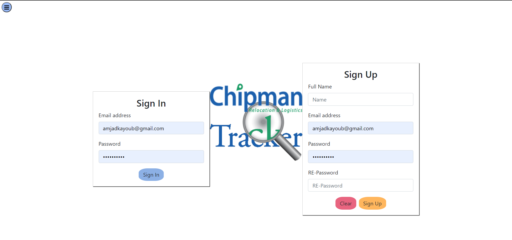
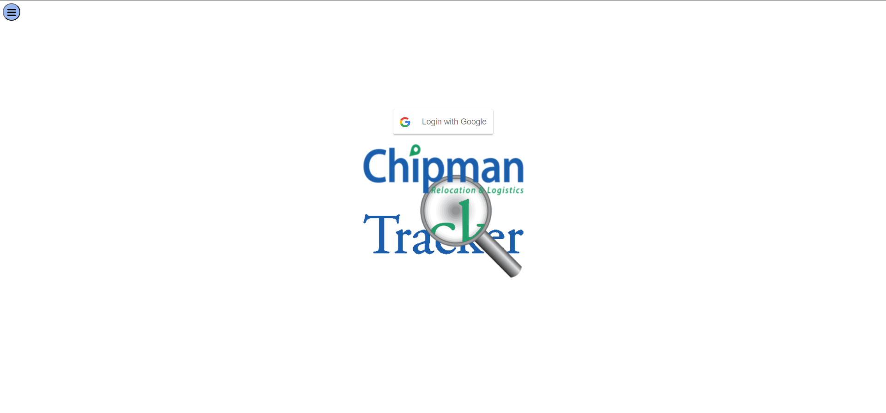
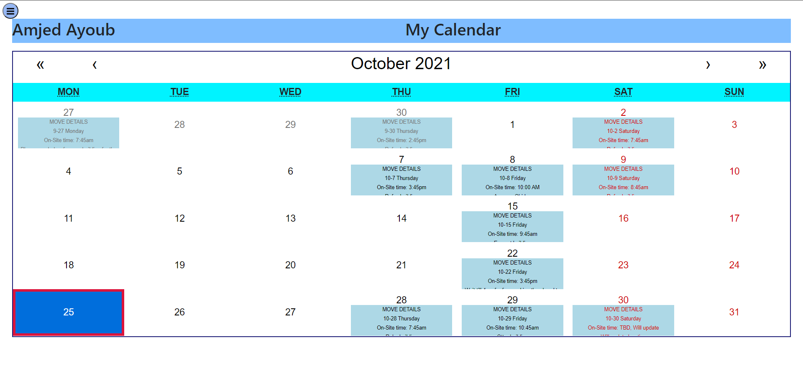
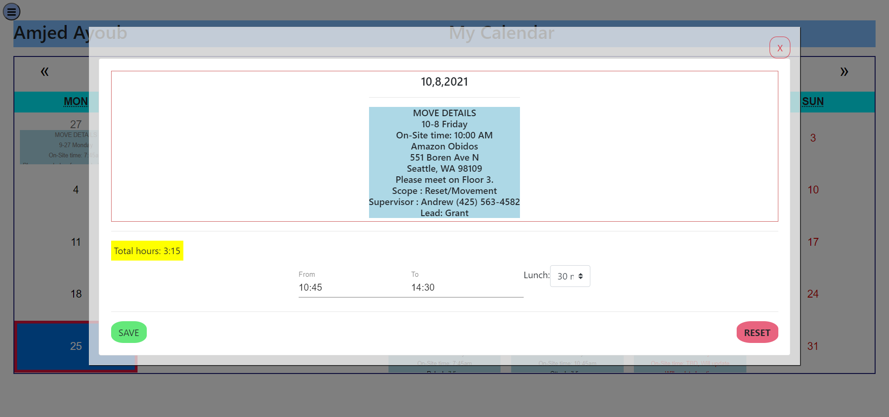
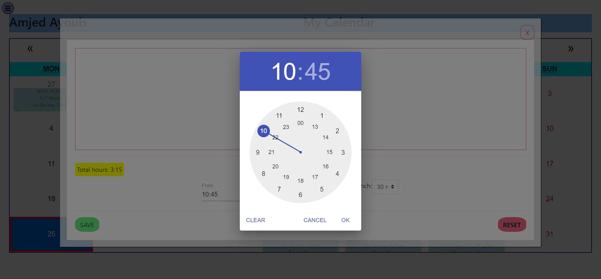
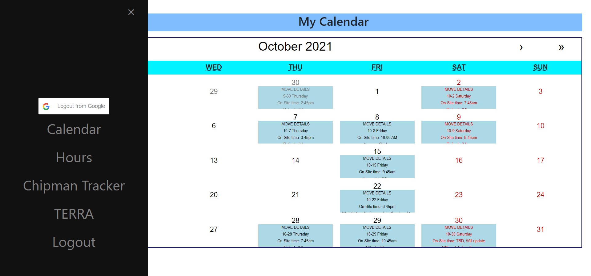
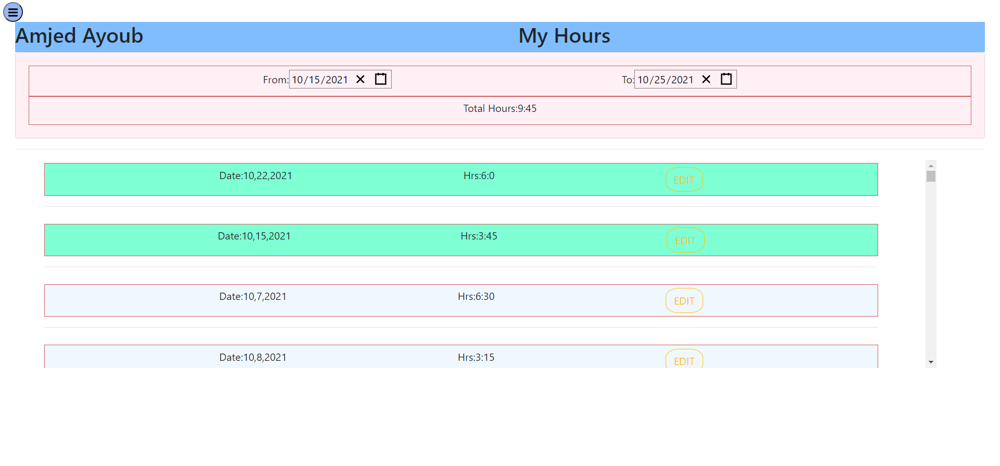

# Chipman-Tracker

Overview:
Chipman Tracker is a Website designed for Chipman relocations and logistics company is greater Seattle area, the company usually sends emails to it's employees about the moves schedules. The main purpose of this website is to track those emails and put them into a calendar.  

## Getting Started
These instructions will get you a copy of the project up and running on your local machine for development and testing purposes.

### Installing
Git clone the repository to your local machine:

HTTPS:
```
https://github.com/AmjedAyoub/Chipman-Tracker.git
```
SSH:
```
gh repo clone AmjedAyoub/Chipman-Tracker
```

Open the cloned repository in your visual studio.

You will then be able to start the app locally by running:

```
npm install
```

```
npm start
```

# Technologies Used:
 * APIs:
    * Google Gmail API
    
* Programming Language:
    * JavaScript
    * React
    * NodeJS

# Instructions:
Chipman Tracker is mobile friendly and easy to use! It does require user authentication, so users will need to make an account when they first enter the site. 

* 1)Users enter the homepage and can either login or create an account.
Login


* 1)Users enter the Google page and can either login 


* 2)Once they are logged in, they are directed to Home page


* 3)View Day will lead them to a page where they can add or update there hours. 



* 4)The menu which will allow users to navigate between pages. 


* 5) There Hours page.


## Links
This program is deployed on [Heroku](https://chipmantrack.herokuapp.com/).\
This program is published on [GitHub](https://github.com/AmjedAyoub/Chipman-Tracker).

## Authors
See contribution history [here](https://github.com/AmjedAyoub/Chipman-Tracker/graphs/contributors).
